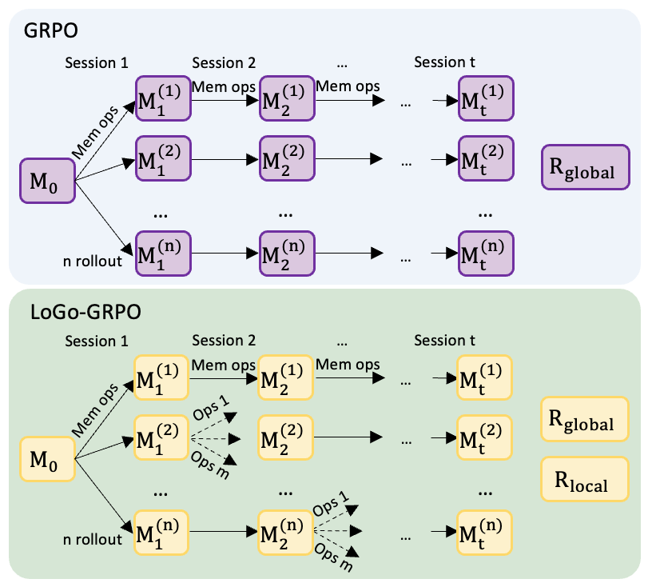
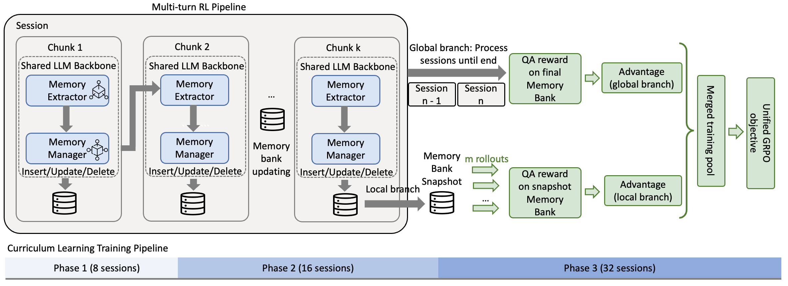
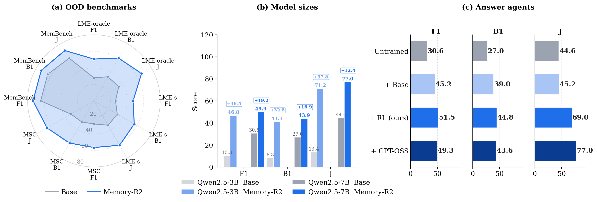
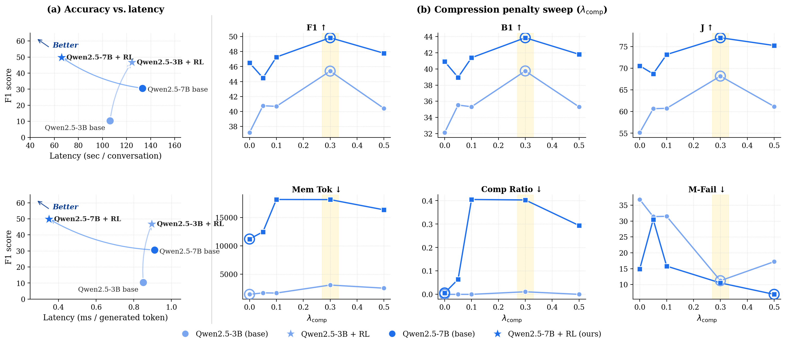

# Memory-R2: Fair Credit Assignment for Long-Horizon Memory-Augmented LLM Agents

This repository contains the code, training scripts, and evaluation pipelines for **Memory-R2**, a training framework for memory-augmented LLM agents that learn to manage external memory across very long multi-session conversations.

At its core is **LoGo-GRPO**, a credit-assignment algorithm that combines **lo**cal and **g**l**o**bal group-relative optimization to fix the rollout-divergence bias that plagues vanilla GRPO when intermediate state evolves across sessions.

> Memory-R2 builds on the [ReMA framework](https://github.com/ziyuwan/ReMA-public). The original ReMA README is preserved as [`REMA_UPSTREAM_README.md`](REMA_UPSTREAM_README.md) for reference.

---

## Overview

Long-horizon LLM agents need to *form*, *evolve*, and *retrieve* memory across many sessions. Memory-R2 trains a single LLM to act as both a **memory extractor** (turns dialogue chunks into atomic facts) and a **memory manager** (issues `INSERT` / `UPDATE` / `DELETE` operations on a persistent memory bank), with a curriculum that scales from 8 → 16 → 32 sessions.

### Key contributions

1. **LoGo-GRPO**: a global-plus-local credit-assignment algorithm that anchors local rerollouts at a shared memory snapshot, eliminating the cross-rollout state divergence that biases standard GRPO.
2. **Shared-parameter co-learning**: one LLM backbone with two role-specific prompts (extractor + manager) is trained jointly under a unified RL objective.
3. **Multi-step RL within each session**: each session is split into chunks; the extractor and manager alternate over chunks rather than processing the whole session as one monolithic step.
4. **Curriculum**: stage 1 (8 sessions) → stage 2 (16) → stage 3 (32). Stable long-horizon optimization that direct 32-session training cannot match.

### LoGo-GRPO at a glance



Standard GRPO (top) compares trajectories that progressively diverge in their intermediate memory states using only a terminal global reward — this conflates session-level credit. LoGo-GRPO (bottom) keeps the global reward but additionally re-rolls a session from a shared snapshot, yielding fair within-session comparisons.

### Training pipeline



Each session is processed chunk-by-chunk; per chunk the extractor proposes facts and the manager commits memory operations. After the global rollout, snapshots from sampled sessions are reused for local rerollouts; both signals feed a single GRPO-style objective. The whole stack is wrapped in an 8 → 16 → 32-session curriculum.

---

## Results

### Generalization across benchmarks, model sizes, and answer agents



Memory-R2 transfers to out-of-distribution benchmarks (LongMemEval-oracle/-s, MSC-Self-Instruct, MemBench), generalizes from 3B to 7B with the largest gains on the smaller model, and is robust across answer agents (base Qwen-7B, GRPO-tuned Qwen-7B, GPT-OSS-120B).

### Accuracy vs latency, and the compression-penalty sweep



Memory-R2 moves the operating point to the upper-left of the accuracy–latency plane (higher F1, lower per-conversation latency). The compression-penalty sweep shows a sweet spot at $\lambda_\mathrm{comp} = 0.3$ on both 3B and 7B.

---

## Installation

```bash
conda create -n rema python=3.10
conda activate rema
pip install flash-attn==2.7.4.post1 --no-build-isolation

# RL framework (core)
cd src/verl && pip install -e .

# (optional) SFT framework, only needed if you fine-tune the answer agent
cd src/360-LLaMA-Factory && pip install -e .

# Additional dependencies
pip install -r requirements.txt
```

Tested with CUDA 12.4, PyTorch 2.6, Python 3.10.

### Configure your secrets

The training and scoring pipelines need API access for (a) memory-similarity embeddings and (b) the LLM judge. Copy the template and fill in your keys:

```bash
cp .env.example .env
$EDITOR .env
```

The `.env` is `.gitignore`d. All scripts require these to be set; if missing, the wrapper exits with a clear `Set <VAR> via env or sourced .env file` message. Source it before running:

```bash
set -a && source .env && set +a
```

---

## Data

```bash
# LoCoMo (primary training/eval set)
python data/locomo/data_preprocess.py --max_sessions 32
```

This converts `data/locomo/locomo10.json` into `data/locomo/processed/{train,val,test}.parquet`, where each row is one session-chunk with the cumulative QA pairs visible at that session.

For OOD evaluation (LongMemEval, MSC-Self-Instruct, MemBench), see [`testing/`](testing/) — each pipeline has its own `dataset/` README with download instructions.

---

## Training

There are three ways to run training, depending on what you want:

### A) Quick smoke-test (single stage, 4 sessions × 4 turns) — 3B and 3B-separated

Useful to verify the pipeline + judge wiring on a single stage before launching long runs.

```bash
# Shared-parameter 3B
bash scripts/examples/example_3b.sh

# Separated-parameter 3B (extractor and manager have independent backbones)
bash scripts/examples/example_3b_separated.sh
```

Both fix `MAX_NUM_TURNS=4`, `STAGES=8` (single stage), and run `verl.rema_trainer.main_ppo` directly. **No curriculum loop.**

### B) Full curriculum 8 → 16 → 32 (the paper's training recipe)

The actual curriculum runner is [`scripts/examples/_curriculum_learning.sh`](scripts/examples/_curriculum_learning.sh). It loops over a `STAGES=(...)` array, runs PPO for each stage, converts the FSDP checkpoint to HF format, and uses that as the warm-start for the next stage.

```bash
# Edit the script to set STAGES, COMPRESSION_PENALTY, NUM_TRAIN_CONVS, num_rollouts, etc.
# Default is STAGES=(32) (single 32-sess stage). For the full paper curriculum:
#   STAGES=(8 16 32)
bash scripts/examples/_curriculum_learning.sh
```

This is what the paper uses for the canonical Memory-R2 7B / 3B Memory-R2 checkpoints.

### C) Single-stage compression-sweep launchers (used to fill `tab:compression`)

For the λ-consistent compression sweep (each row of `tab:compression`), training is split into two single-stage launchers that warm-start from each other. **The 8sess(λ) ckpt is the warm-start for 32sess(λ); both stages train at the SAME λ.**

```bash
# 3B sweep — single λ (e.g. 0.3): trains 8sess(λ=0.3) → 32sess(λ=0.3)

# Stage 1: 3B 8sess at target λ (warm-starts from Qwen2.5-3B base)
# (the 8sess ckpts already exist in checkpoints/rema-curriculum-v1/curr_8sess_p7_3b_*; reuse)

# Stage 2: 3B 32sess at target λ (warm-starts from corresponding 8sess(λ))
COMP_LAMBDA=0.3 \
WARM_START_PATH=checkpoints/rema-curriculum-v1/curr_8sess_p7_3b_comp03_8sess_h200_*/global_step_10/hf_fixed \
  bash scripts/vllm_clients/vllm_client_3b_32sess_lambda_sweep.sh

# 7B sweep — same shape, both stages need to be trained from scratch:

# Stage 1: 7B 8sess at target λ (from Qwen2.5-7B-Instruct base)
COMP_LAMBDA=0.3 \
  bash scripts/vllm_clients/vllm_client_7b_8sess_lambda_sweep.sh

# Stage 2: 7B 32sess at target λ (warm-start from above)
COMP_LAMBDA=0.3 \
WARM_START_PATH=checkpoints/rema-curriculum-v1/curr_8sess_p7_8sess_lambda03_consistent_*/global_step_5/hf_fixed \
  bash scripts/vllm_clients/vllm_client_7b_32sess_lambda_sweep.sh
```

These per-stage launchers all delegate to [`scripts/vllm_clients/vllm_client_standalone.sh`](scripts/vllm_clients/vllm_client_standalone.sh), which expects a vLLM judge server (see below) to be reachable for QA reward computation.

### D) Single-agent ablation (manager-only, no extractor)

Set `actor_rollout_ref.rollout.single_agent_mode=true` (the default `false` runs the standard two-agent pipeline). A ready-made launcher is provided:

```bash
bash scripts/vllm_clients/vllm_client_8sess_single_agent.sh
```

---

## LLM Judge — three options

Memory-R2's QA reward and final scoring use an LLM judge. The implementation is in [`src/verl/verl/rema_trainer/memory/judge_llm.py`](src/verl/verl/rema_trainer/memory/judge_llm.py); the choice is controlled by `JUDGE_PROVIDER`.

### Option 1 — Local `gpt-oss-120b` via vLLM (default during training)

Start a vLLM server on a free GPU node:

```bash
srun --jobid=<H200_alloc> --overlap -N1 -n1 \
  env VLLM_JUDGE_MODEL=openai/gpt-oss-120b \
      VLLM_TENSOR_PARALLEL=4 \
      VLLM_MAX_MODEL_LEN=32768 \
      VLLM_PORT=8107 \
      SERVER_IDX=0 \
      RENDEZVOUS_DIR=$PWD/vllm_servers \
  bash $PWD/vllm_server_standalone.sh
```

Then in the client/training shell:

```bash
export JUDGE_PROVIDER=openai
export JUDGE_BASE_URLS=http://<host>:8107/v1   # comma-sep for round-robin if multiple
export OPENAI_JUDGE_MODEL=openai/gpt-oss-120b
export JUDGE_API_KEY=EMPTY                     # vLLM ignores the key but the field is required
```

This is what the paper uses for all in-distribution scoring.

### Option 2 — OpenAI API (`gpt-4o-mini` or any other)

Useful when no local GPU node is free, or when you want the judge **disjoint from the answer agent** (we use this for `tab:ood-datasets` because `gpt-oss-120b` doubles as our LoCoMo answer agent):

```bash
export JUDGE_PROVIDER=openai
export JUDGE_BASE_URLS=https://api.openai.com/v1
export OPENAI_JUDGE_MODEL=gpt-4o-mini       # or gpt-4o, gpt-5, ...
export JUDGE_API_KEY=$OPENAI_API_KEY        # real OpenAI key from .env
```

You can also list multiple OpenAI-compatible base URLs (e.g., your own deployment + the hosted API) and `judge_llm.py` will round-robin across them per attempt.

### Option 3 — Together AI (hosted `openai/gpt-oss-120b` or any Together model)

```bash
export JUDGE_PROVIDER=together
export TOGETHER_API_KEY=$TOGETHER_API_KEY               # comma-sep multiple keys for higher RPS
export TOGETHER_JUDGE_MODEL=openai/gpt-oss-120b         # or any other Together-served model
```

### Option 4 — Google Gemini

```bash
export JUDGE_PROVIDER=gemini
export GEMINI_API_KEY=$GEMINI_API_KEY
export GEMINI_JUDGE_MODEL=gemini-2.5-flash-lite
```

All four backends share the same on-disk cache (`judge_cache.json`), so switching providers mid-experiment does not re-judge already-scored items.

---

## Evaluation

### LoCoMo (in-distribution)

```bash
# Test-time eval producing a 1085-QA dump
REMA_DUMP_QA=1 VAL_KWARGS_N=1 \
MODEL_PATH_OVERRIDE=<path/to/checkpoints/.../global_step_5/hf_fixed> \
  bash scripts/vllm_clients/vllm_client_test_eval.sh

# Score the dump with whatever judge you configured
python testing/pipeline_test_locomo_qa_dump/score_locomo_qa_dumps.py \
  --dump_root qa_dumps/<run_tag>/test/step_unknown \
  --output results/judge_scores/<run_tag>_judge.json \
  --max_workers 32
```

### Out-of-distribution benchmarks

See per-benchmark README and Makefile inside:

- [`testing/pipeline_test_longmemeval/`](testing/pipeline_test_longmemeval/) — LongMemEval (oracle + s)
- [`testing/pipeline_test_msc/`](testing/pipeline_test_msc/) — MSC-Self-Instruct
- [`testing/pipeline_test_membench/`](testing/pipeline_test_membench/) — MemBench

---

## Repository layout

```
.
├── prompt/math/multi_turn_mamrp.py    # MEMORY_REASONER, MEMORY_EXECUTOR, SINGLE_AGENT prompts
├── data/locomo/                        # Primary dataset + preprocess
├── src/verl/                           # Core RL framework (forked verl)
│   └── verl/
│       ├── rema_trainer/               # Shared-parameter training
│       │   ├── main_ppo.py
│       │   ├── ppo/ray_trainer.py
│       │   └── memory/                 # Memory bank, judge, embedding cache
│       ├── rema_separated_trainer/     # Separate-parameter training
│       └── workers/
│           ├── reward_manager/rema.py  # ReMARewardManager (QA F1 + memory ops + comp penalty)
│           └── rollout/vllm_rollout/vllm_rollout_spmd.py   # Multi-turn rollout loop
├── scripts/
│   ├── examples/                       # Top-level entry points (example_3b.sh, ...)
│   ├── vllm_clients/                   # Training launchers (per stage / per ablation)
│   ├── vllm_servers/                   # Judge / answer-agent vLLM server launchers
│   ├── rl/                             # Older curriculum scripts
│   └── setup/                          # setup_judge_env.sh, vllm_two_node.sh
├── testing/
│   ├── pipeline_test_longmemeval/      # OOD: LongMemEval
│   ├── pipeline_test_msc/              # OOD: MSC-Self-Instruct
│   ├── pipeline_test_membench/         # OOD: MemBench
│   └── pipeline_test_locomo_qa_dump/   # LoCoMo post-process scorer
├── sft/                                # Optional: SFT data prep + answer-agent fine-tuning utils
├── figures/                            # Paper figures used in this README
├── .env.example                        # Template — copy to .env and fill in your keys
└── REMA_UPSTREAM_README.md             # Original upstream ReMA README (preserved)
```

---

## Reproducing the paper

The headline numbers in `tab:main`, `tab:ood-datasets`, `tab:model_size`, `tab:different-answer-agent`, `tab:ablation`, `tab:compression`, `tab:acc_latency` are reproduced by:

1. **3B sweep** ($\lambda_\mathrm{comp} \in \{0, 0.05, 0.1, 0.3, 0.5\}$): each chain is `3B 8sess(λ) → 3B 32sess(λ)` with `scripts/vllm_clients/vllm_client_3b_32sess_lambda_sweep.sh`.
2. **7B sweep**: same structure, `vllm_client_7b_8sess_lambda_sweep.sh` then `vllm_client_7b_32sess_lambda_sweep.sh`. Each stage takes ~5 h on H200×4.
3. **OOD generalization**: the trained 32-session checkpoints are evaluated zero-shot using the pipelines under `testing/`.
4. **Different answer agents**: swap `actor_rollout_ref.model.path` (or use the paired `vllm_server_qwen_*.sh` launchers) to test base Qwen, GRPO-tuned Qwen, or GPT-OSS-120B as the answer agent.

A complete description of every paper cell — including source artifacts and the per-cell decision log — lives in [`program.md`](program.md).

---

## Citation

```bibtex
@article{memory_r2_2026,
  title  = {Memory-R2: Fair Credit Assignment for Long-Horizon Memory-Augmented LLM Agents},
  author = {Anonymous},
  year   = {2026},
  note   = {Under review}
}
```

If you use the underlying multi-agent framework, please also cite the upstream ReMA paper:

```bibtex
@article{rema_2025,
  title  = {ReMA: Learning to Meta-think for LLMs with Multi-Agent Reinforcement Learning},
  author = {Wan, Ziyu and others},
  year   = {2025}
}
```

---

## License & acknowledgments

This repository builds on the [ReMA-public](https://github.com/ziyuwan/ReMA-public) and [verl](https://github.com/volcengine/verl) frameworks, both Apache-2.0. See [`LICENSE`](LICENSE).
